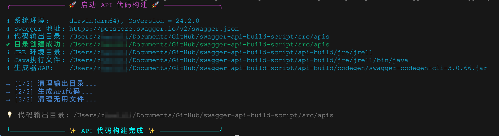

# Swagger API 代码生成工具

这是一个简单的 NodeJS 脚本工具，用于在本地从 Swagger/OpenAPI 规范接口构建生成 TypeScript API 客户端代码。



## 使用方法

1. 复制完整的 `api-build` 目录到你的前端项目目录中
2. 根据你的OS，删除 `api-build/jre` 目录下多余的 jre 压缩包。例如: Windows 系统仅需保留 `jre11_x64_windows.zip`，其他 3 个 jre 压缩包可以删除，jre 压缩包无需解压，脚本会自动处理。
3. 如果不想提交 jre文件，请记得把 jre 目录添加到 `.gitignore`
4. 工具不需要安装和配置 Java 环境

基本命令格式:

```bash
node api-build/build.js <swagger-url> <output-directory>
```

脚本使用示例:

```bash
node api-build/build.js "https://petstore.swagger.io/v2/swagger.json" "src/apis"
```

package.json 快捷方式：

```json
{
  "scripts": {
    "build:api": "node api-build/build.js \"https://petstore.swagger.io/v2/swagger.json\" \"src/apis\""
  },
}
```

```bash
pnpm build:api
```

> **注意:** swagger-url 本地使用https `https://localhost:xxx` 可能会报错，请使用 `http://localhost:xxx`。

## 环境及依赖

- Node.js 18.0 或更高版本
- 已内置常见系统的 JRE11 包
- swagger-codegen-cli.jar
  - 下载地址：[https://repo1.maven.org/maven2/io/swagger/codegen/v3/swagger-codegen-cli/](https://repo1.maven.org/maven2/io/swagger/codegen/v3/swagger-codegen-cli/)

### JRE 11 最新版下载指南（可选）

1. 访问 [Adoptium](https://adoptium.net/)
2. 在下载页面选择：
   - Version: OpenJDK 11 (LTS)
   - Operating System: 选择您的操作系统
   - Architecture: 选择您的系统架构
   - Package Type: JRE
   - 寻找带有 "Compressed Archive" 或 "zip/tar.gz" 的下载选项
3. 下载后解压到项目的 `api-build/jre/jre11` 目录下
